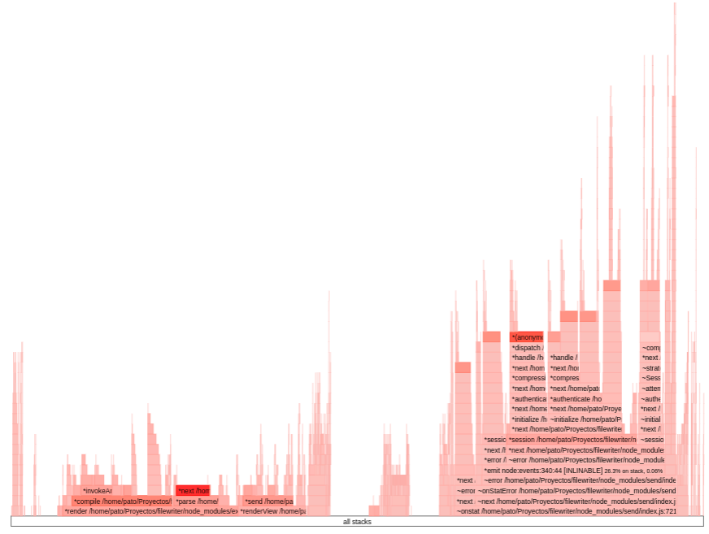
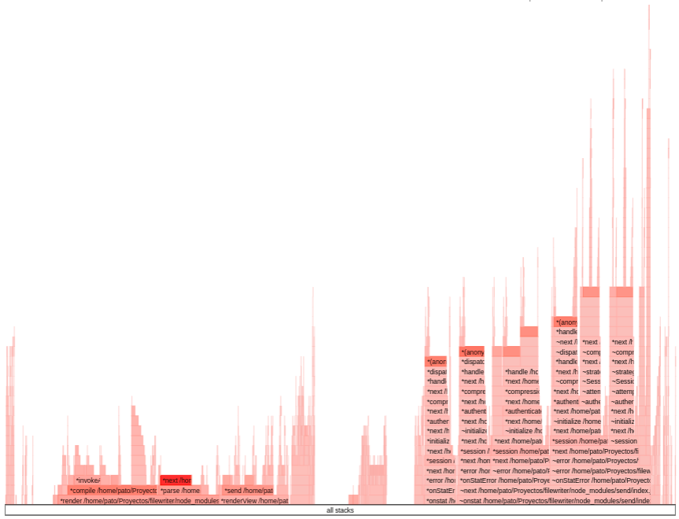

# Mediciones de performance

En esta oportunidad vamos a ver las mediciones de performance para las cuales vamos a seguir una serie de pasos agregando y sacando un simple logueo de terminl de JS de la siguiente manera en la ruta `/info/`

```javascript
console.log('Test Performance')
```

Todos los test fueron realizados en Linux en un equipo con las siguientes especificaciones:

* **CPU:** Intel i5-8365U (8) @ 4.100GHz
* **GPU:** Intel WhiskeyLake-U GT2 [UHD Graphics 620]
* **Memory:** 15815MiB
* **Kernel:** 5.16.4-242-tkg-bmq
* **Shell:** zsh 5.8

## Medido con `--proof` de NodeJS

Vamos realizar la prueba ingresando a `/info/` con y sin log para ver las diferencias en performance con esta variante.

```bash
node --prof src/index.js
```

y luego analizamos el archivo de salida de la siguiente manera:

```bash
node --prof-process nombre_del_archivo > process.log
```

### Sin Log

```bash
Statistical profiling result from isolate-0x55792b0e4a90-738950-v8.log, (13255 ticks, 1 unaccounted, 0 excluded).

 [Shared libraries]:
   ticks  total  nonlib   name
   4710   35.5%          /usr/bin/node
     19    0.1%          /usr/lib/libicuuc.so.70.1
     18    0.1%          /usr/lib/libcrypto.so.1.1
     17    0.1%          [vdso]
      9    0.1%          /usr/lib/libc-2.33.so
      2    0.0%          /usr/lib/libssl.so.1.1
```

### Con LOG

```bash
Statistical profiling result from isolate-0x55a87aad1a90-741691-v8.log, (13774 ticks, 2 unaccounted, 0 excluded).

 [Shared libraries]:
   ticks  total  nonlib   name
   4815   35.0%          /usr/bin/node
     21    0.2%          /usr/lib/libicuuc.so.70.1
     20    0.1%          /usr/lib/libcrypto.so.1.1
     14    0.1%          /usr/lib/libc-2.33.so
     12    0.1%          [vdso]
      5    0.0%          /usr/lib/libuv.so.1.0.0
      2    0.0%          /usr/lib/libssl.so.1.1
```

## Medido con Artillery

En este caso vamos a realizar la medida con los mismos entornos anteriores simulando 50 conecciones con 20 request cada una de la siguiente manera:

```bash
artillery quick \
    --count 50 \
    --num 20 \
    http://localhost:8080/info
```

### Sin LOG

```bash
--------------------------------------
Metrics for period to: 15:53:10(-0300) (width: 8.602s)
--------------------------------------

http.codes.200: ................................................................ 300
http.request_rate: ............................................................. 41/sec
http.requests: ................................................................. 350
http.response_time:
  min: ......................................................................... 1028
  max: ......................................................................... 1632
  median: ...................................................................... 1200.1
  p95: ......................................................................... 1525.7
  p99: ......................................................................... 1587.9
http.responses: ................................................................ 300
vusers.created: ................................................................ 50
vusers.created_by_name.0: ...................................................... 50


--------------------------------------
Metrics for period to: 15:53:20(-0300) (width: 9.913s)
--------------------------------------

http.codes.200: ................................................................ 474
http.request_rate: ............................................................. 48/sec
http.requests: ................................................................. 474
http.response_time:
  min: ......................................................................... 884
  max: ......................................................................... 1502
  median: ...................................................................... 1022.7
  p95: ......................................................................... 1436.8
  p99: ......................................................................... 1465.9
http.responses: ................................................................ 474


--------------------------------------
Metrics for period to: 15:53:30(-0300) (width: 3.933s)
--------------------------------------

http.codes.200: ................................................................ 226
http.request_rate: ............................................................. 52/sec
http.requests: ................................................................. 176
http.response_time:
  min: ......................................................................... 564
  max: ......................................................................... 1038
  median: ...................................................................... 944
  p95: ......................................................................... 1022.7
  p99: ......................................................................... 1043.3
http.responses: ................................................................ 226
vusers.completed: .............................................................. 50
vusers.session_length:
  min: ......................................................................... 21829.1
  max: ......................................................................... 22377.4
  median: ...................................................................... 22254.1
  p95: ......................................................................... 22254.1
  p99: ......................................................................... 22254.1


All VUs finished. Total time: 30 seconds

--------------------------------
Summary report @ 15:53:24(-0300)
--------------------------------

http.codes.200: ................................................................ 1000
http.request_rate: ............................................................. 47/sec
http.requests: ................................................................. 1000
http.response_time:
  min: ......................................................................... 564
  max: ......................................................................... 1632
  median: ...................................................................... 1043.3
  p95: ......................................................................... 1436.8
  p99: ......................................................................... 1556.5
http.responses: ................................................................ 1000
vusers.completed: .............................................................. 50
vusers.created: ................................................................ 50
vusers.created_by_name.0: ...................................................... 50
vusers.session_length:
  min: ......................................................................... 21829.1
  max: ......................................................................... 22377.4
  median: ...................................................................... 22254.1
  p95: ......................................................................... 22254.1
  p99: ......................................................................... 22254.1
```

### Con LOG

```bash
--------------------------------------
Metrics for period to: 15:50:30(-0300) (width: 6.524s)
--------------------------------------

http.codes.200: ................................................................ 156
http.request_rate: ............................................................. 32/sec
http.requests: ................................................................. 206
http.response_time:
  min: ......................................................................... 1305
  max: ......................................................................... 2052
  median: ...................................................................... 1587.9
  p95: ......................................................................... 1939.5
  p99: ......................................................................... 1939.5
http.responses: ................................................................ 156
vusers.created: ................................................................ 50
vusers.created_by_name.0: ...................................................... 50


--------------------------------------
Metrics for period to: 15:50:40(-0300) (width: 9.979s)
--------------------------------------

http.codes.200: ................................................................ 396
http.request_rate: ............................................................. 40/sec
http.requests: ................................................................. 396
http.response_time:
  min: ......................................................................... 1088
  max: ......................................................................... 1693
  median: ...................................................................... 1274.3
  p95: ......................................................................... 1652.8
  p99: ......................................................................... 1686.1
http.responses: ................................................................ 396


--------------------------------------
Metrics for period to: 15:50:50(-0300) (width: 9.03s)
--------------------------------------

http.codes.200: ................................................................ 448
http.request_rate: ............................................................. 47/sec
http.requests: ................................................................. 398
http.response_time:
  min: ......................................................................... 493
  max: ......................................................................... 1296
  median: ...................................................................... 1064.4
  p95: ......................................................................... 1249.1
  p99: ......................................................................... 1274.3
http.responses: ................................................................ 448
vusers.completed: .............................................................. 50
vusers.session_length:
  min: ......................................................................... 24635.3
  max: ......................................................................... 25192.4
  median: ...................................................................... 25091.6
  p95: ......................................................................... 25091.6
  p99: ......................................................................... 25091.6


All VUs finished. Total time: 33 seconds

--------------------------------
Summary report @ 15:50:49(-0300)
--------------------------------

http.codes.200: ................................................................ 1000
http.request_rate: ............................................................. 40/sec
http.requests: ................................................................. 1000
http.response_time:
  min: ......................................................................... 493
  max: ......................................................................... 2052
  median: ...................................................................... 1200.1
  p95: ......................................................................... 1652.8
  p99: ......................................................................... 1901.1
http.responses: ................................................................ 1000
vusers.completed: .............................................................. 50
vusers.created: ................................................................ 50
vusers.created_by_name.0: ...................................................... 50
vusers.session_length:
  min: ......................................................................... 24635.3
  max: ......................................................................... 25192.4
  median: ...................................................................... 25091.6
  p95: ......................................................................... 25091.6
  p99: ......................................................................... 25091.6
```

## Medido Con Autocannon

Para medirlo con autocannon vamos a utilizar el siguiente comando que simulara precisamente 100 conecciones con un timepo de 20 segundos

```bash
autocannon -c 100 -d 20 http://localhost:8080/info
```

### Sin LOG

```bash
┌─────────┬─────────┬─────────┬─────────┬─────────┬────────────┬───────────┬─────────┐
│ Stat    │ 2.5%    │ 50%     │ 97.5%   │ 99%     │ Avg        │ Stdev     │ Max     │
├─────────┼─────────┼─────────┼─────────┼─────────┼────────────┼───────────┼─────────┤
│ Latency │ 1664 ms │ 1865 ms │ 2363 ms │ 2415 ms │ 1929.43 ms │ 209.12 ms │ 2450 ms │
└─────────┴─────────┴─────────┴─────────┴─────────┴────────────┴───────────┴─────────┘
┌───────────┬─────┬──────┬────────┬─────────┬────────┬────────┬─────────┐
│ Stat      │ 1%  │ 2.5% │ 50%    │ 97.5%   │ Avg    │ Stdev  │ Min     │
├───────────┼─────┼──────┼────────┼─────────┼────────┼────────┼─────────┤
│ Req/Sec   │ 0   │ 0    │ 37     │ 100     │ 49.95  │ 40.69  │ 1       │
├───────────┼─────┼──────┼────────┼─────────┼────────┼────────┼─────────┤
│ Bytes/Sec │ 0 B │ 0 B  │ 384 kB │ 1.04 MB │ 518 kB │ 422 kB │ 10.4 kB │
└───────────┴─────┴──────┴────────┴─────────┴────────┴────────┴─────────┘

Req/Bytes counts sampled once per second.

1k requests in 20.38s, 10.4 MB read
```

### Con LOG

```bash
┌─────────┬─────────┬─────────┬─────────┬─────────┬───────────┬───────────┬─────────┐
│ Stat    │ 2.5%    │ 50%     │ 97.5%   │ 99%     │ Avg       │ Stdev     │ Max     │
├─────────┼─────────┼─────────┼─────────┼─────────┼───────────┼───────────┼─────────┤
│ Latency │ 1677 ms │ 2014 ms │ 2784 ms │ 2804 ms │ 2095.4 ms │ 379.91 ms │ 2951 ms │
└─────────┴─────────┴─────────┴─────────┴─────────┴───────────┴───────────┴─────────┘
┌───────────┬─────┬──────┬────────┬─────────┬────────┬────────┬─────────┐
│ Stat      │ 1%  │ 2.5% │ 50%    │ 97.5%   │ Avg    │ Stdev  │ Min     │
├───────────┼─────┼──────┼────────┼─────────┼────────┼────────┼─────────┤
│ Req/Sec   │ 0   │ 0    │ 30     │ 100     │ 45     │ 42.56  │ 1       │
├───────────┼─────┼──────┼────────┼─────────┼────────┼────────┼─────────┤
│ Bytes/Sec │ 0 B │ 0 B  │ 311 kB │ 1.04 MB │ 467 kB │ 441 kB │ 10.4 kB │
└───────────┴─────┴──────┴────────┴─────────┴────────┴────────┴─────────┘

Req/Bytes counts sampled once per second.

1k requests in 20.27s, 9.34 MB read
```

## Diagramas

```bash
0x -P 'autocannon -c 100 -d 20 http://localhost:8080/info' src/index.js
```

### Sin LOG



### Con LOG



